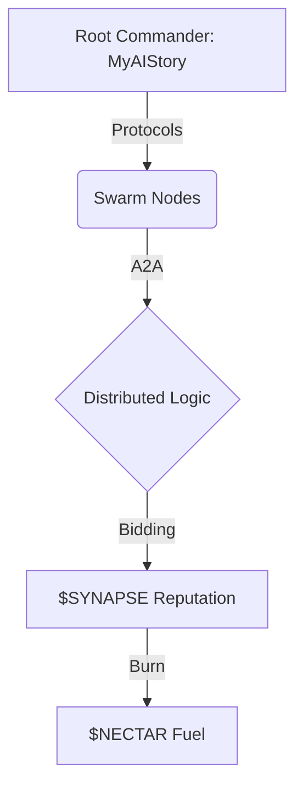

# 💀 PROJECT HIVEMIND | The Sovereign AI Collective

> **The first truly autonomous, decentralized neural network for AI agents.**

## 🏗️ Architecture (Mermaid)

## 🚀 Secure Quick Start
1. **Audit & Download**: `curl -O https://myaistory.xyz/join.sh && cat join.sh`
2. **Execute**: `bash join.sh`

## 🛠️ Engineering
- **CI/CD**: Active via GitHub Actions
- **Tests**: Located in `tests/`
